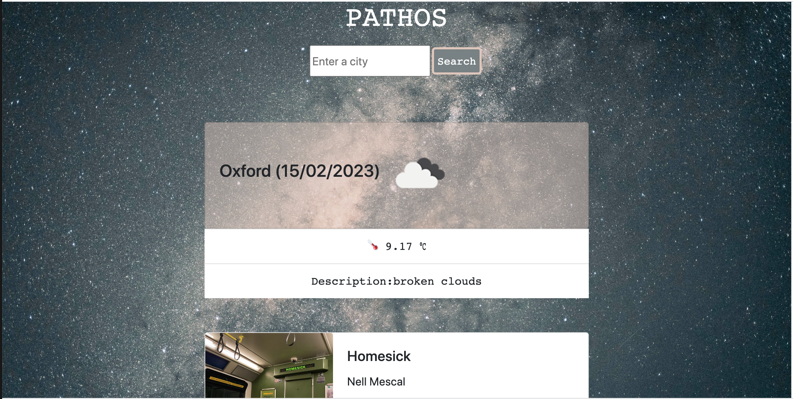

# Pathos

As a user I want to be able to get a song suggestion for the current weather in a given city.
The website will use Openweather and Spotify APIs.
Spotify API key - d978d9fe4a5c4adeb3cc1bde0333555c

## Description

Pathos is an application that allows user to search for any city of their choice and displays the current weather condition, and also suggest different songs based on weather conditions of the searched city.

## Installation

The following APIs were used for this project:

- Openweatherapi API
- Spotify API

## Usage

Copy this url("https://daria0862.github.io/pathos/"), paste on the browser, click on the "Enter a city" then type in your desired city you wish to go and finally click on the "Search" button.

Here is the screenshot of what the form look like:

## License

Please refer to the license on the README file.
